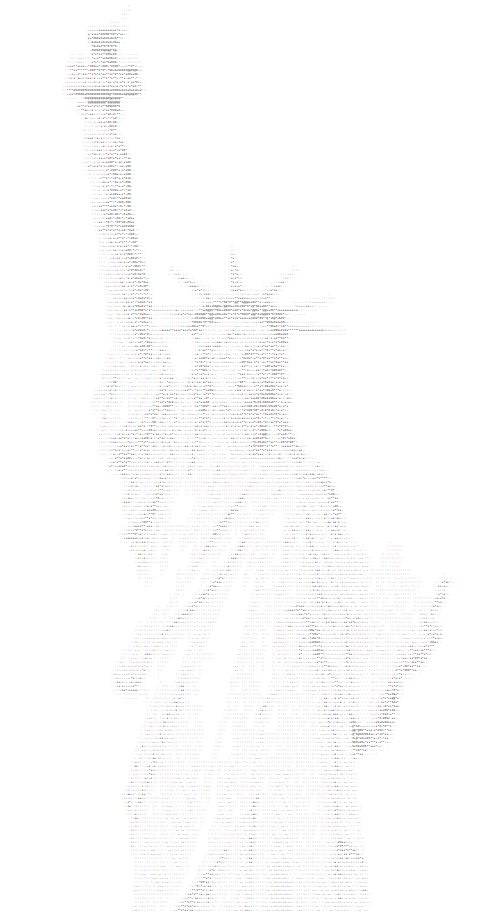

# ImageToASCII

Takes an image filepath + optional technical stuff and spits out an ASCII art version.  
Takes an image, breaks the image up into sub-images (the width and height is the 'resolution'),  
takes the average brightness value and then groups like chars and modifies them via grouping modifier determined in a map.

Enjoy!!! :)

   

~~There is a shrek-side-project branch which is the branch I'm using to translate the shrek movie into ascii It's very much a mess so :p~~